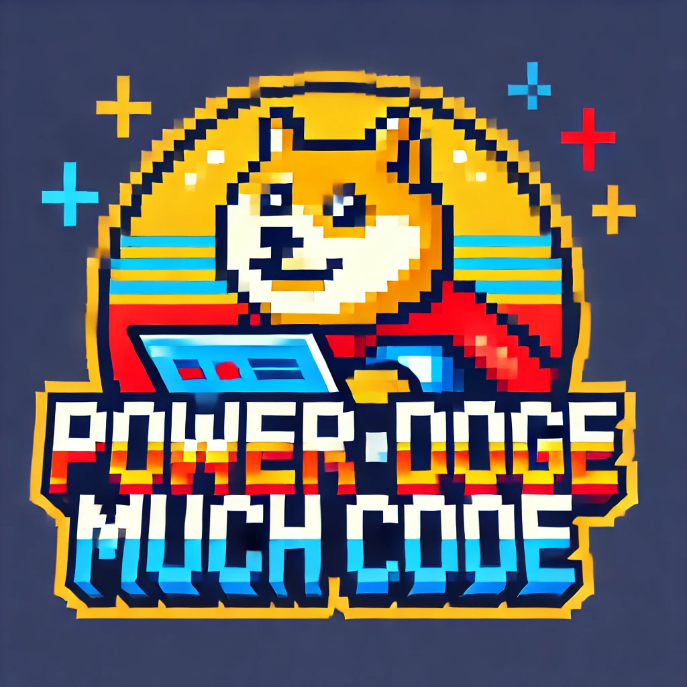

# PowerDoge



PowerDoge is an open source starterkit template with some framework elements for building model driven app solutions in PowerApps that
makes extensive use of JavaScript client libraries and approaches.

## Pre-requisites
* VS Code
* Node > v18 via NVM
* PowerApps CLI (PAC) - https://learn.microsoft.com/en-us/power-platform/developer/cli/introduction?tabs=windows
* Access to your PowerApps DEV environment
* Global npm tools
``` Sh
npm install -g yarn
```

## Getting started
Installing dependencies:
``` Sh
yarn install
```

Authenticate PAC with your PowerApps DEV environment:
``` Sh
pac auth
```

## Working with solutions

Build a solution:
``` Sh
yarn build <solution>
```

Sync a solution from the DEV environment to local:
``` Sh
yarn sync <solution>
```

Deploy a solution from local to the DEV environment:
``` Sh
yarn deploy <solution>
```